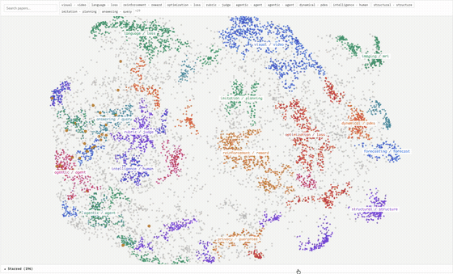
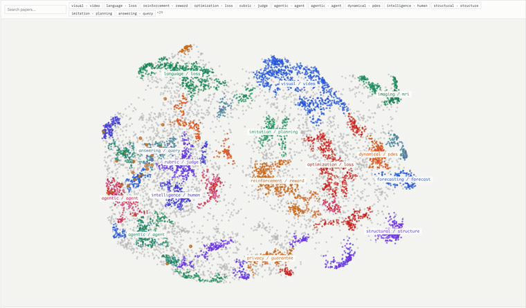
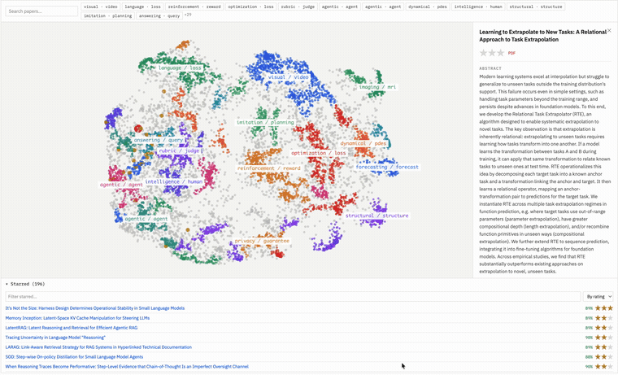

# arxiv-compass

arXiv paper discovery powered by SPECTER2 + BERTopic — embedding-based retrieval and topic clustering to generate daily paper recommendations.

<p align="center">
  
</p>

---

## End-to-end flow

```
[Daily] Fetch and score new papers directly from arXiv
                │
                ▼
        ┌─────────────────────────────────────┐
        │ fetch_daily.py                      │
        │ Fetch new papers from the arXiv API │
        │ → Embedding (SPECTER2)              │
        │ → Score via α-blend of              │
        │   interest_profile + ratings        │
        │ → Sort by score and save to data/   │
        └─────────────────────────────────────┘
                │
                │  Star papers to accumulate ratings
                ▼
        Cloudflare KV
        * Batches read it via GET /api/ratings
                │
                │
[Monthly]       ▼
        ┌─────────────────────────────────────┐
        │ Fetch 10,000 arXiv papers           │
        │ Topic modeling with BERTopic        │
        │ → Generate the paper map (map.json) │
        └─────────────────────────────────────┘
                │
                │
[Weekly]        ▼
        ┌────────────────────────────────────────────┐
        │ ratings.json × map.json                    │
        │ → Identify your interest clusters          │
        │ → Surface nearby papers as recommendations │
        │ → Show adjacent clusters as                │
        │   serendipity picks                        │
        └────────────────────────────────────────────┘
```

---

## How the topic modeling works

```
10,000 paper abstracts
        │
        ▼
  [STEP 1] Embedding (SPECTER2 + proximity adapter)
  Convert each abstract into a 768-dim vector
        │
        ▼
  [STEP 2] PCA (768-dim → 50-dim)
  Drop noisy dimensions to improve UMAP input quality
        │
        ▼
  [STEP 3] UMAP (50-dim → 2-dim)
  Unify clustering and visualization in the same space
  * "closeness on the map" matches "closeness in clustering"
        │
        ▼
  [STEP 4] Clustering with HDBSCAN
  Density-based automatic grouping (cluster count decided automatically)
        │
        ▼
  [STEP 5] Keyword candidate extraction with c-TF-IDF
  Statistically extract the words that represent each cluster
  * Lemmatize word forms with WordNetLemmatizer (agents → agent, rewards → reward)
  * Remove paper-specific generic words with ACADEMIC_STOPWORDS
        │
        ▼
  [STEP 6] Semantic re-ranking with KeyBERTInspired
  Embed each cluster's representative documents and keyword candidates with SPECTER2,
  and score by cosine similarity (the full 10,000 papers are not re-embedded)
        │
        ▼
  [STEP 7] Ensure diversity with MaximalMarginalRelevance (MMR)
  Account for semantic similarity to already-selected keywords,
  removing conceptually close pairs (e.g. gnn / graph neural network) for a diverse set
        │
        ▼
  map.json (arXiv paper map)
  ┌─────────────────────────────────────────────────┐
  │ cluster: "rlvr & policy optimization & grpo"    │
  │ cluster: "whisper & tts & asr"                  │
  │ cluster: "jailbreak & adversarial"              │
  │ cluster: "fine tuning & lora & rank adaptation" │
  │ ...(dozens of clusters)                         │
  └─────────────────────────────────────────────────┘
```

<p align="center">
  
</p>

### Discovering your interest areas from the map

```
Cloudflare KV
(abstracts of papers you starred)
        │
        ▼
  Identify the clusters your rated papers belong to
        │
        ▼
  Compute the centroid vector of highly-rated clusters
        │
        ▼
  Explore neighboring clusters on the map
  ┌───────────────────────────────────────────────────┐
  │ "Diffusion Models" ← you star these often         │
  │        ↓ close                                    │
  │ "Score-based Generative Models" ← didn't know yet │
  │ "Flow Matching" ← didn't know yet                 │
  └───────────────────────────────────────────────────┘
        │
        ▼
  Generate two kinds of paper lists in recommendations.json:
  - Recommended (7 representative papers from the top 3 clusters)
      → 🔍 Recommended from your history
  - How about these? (7 from 3 adjacent clusters + 3 from the 2 farthest clusters)
      → 🌱 How about these?
```

<p align="center">
  
</p>

---

## How scoring works

Daily, Recommended, and How about these? all use the same α-blend score.

```
α = min(1.0, number_of_ratings / 50)
match_score = α × cos_sim(paper, highly-rated papers) + (1-α) × cos_sim(paper, interest_profile)
```

Early on when ratings are few, similarity to interest_profile dominates;
as ratings accumulate, similarity to the actual rating data takes over.

Describe your interest areas in natural language in `interest_profile` in `config.jsonc` (7 items).

### Choosing between SPECTER2 adapters

| Adapter | Purpose |
|---|---|
| `proximity` | Paper-to-paper similarity (embedding abstracts) |
| `adhoc_query` | Query→paper retrieval (embedding interest_profile) |
